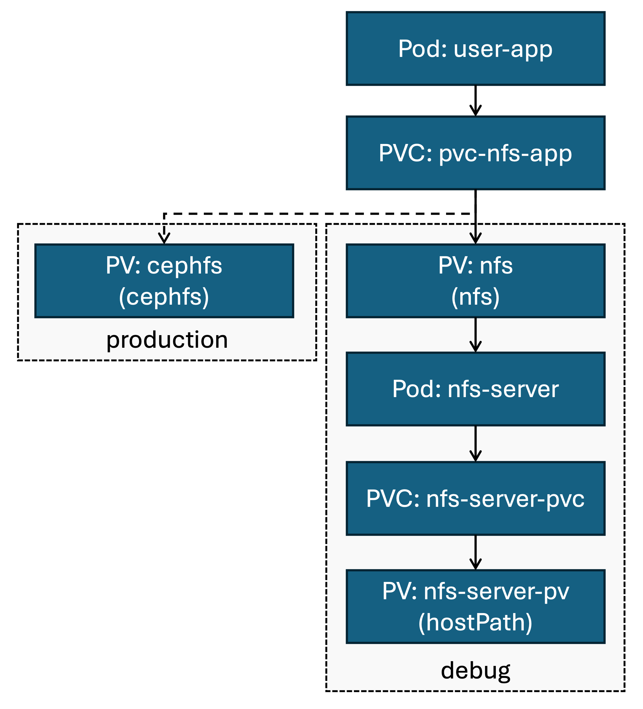

# NFS server

This repository contains the Kubernetes resources definitions to create a NFS server residing in a Kubernetes cluster. The final goal is to expose a single PersistentVolumeClaim that can be used by several pods on the cluster ("`ReadWriteMany`"), while retaining the data, in an environment where no external storage (cloud storage) is available.

Based on:
- https://github.com/kubernetes/examples/tree/master/staging/volumes/nfs
- https://github.com/GoogleCloudPlatform/nfs-server-docker

## Background
In a Cloud environment, several storage solutions are offered by the Cloud provider, meeting various characteristics (capacity, bandwidth, etc.). In the context of Kubernetes cluster, those storage solutions are exposed to the user as various [`PersistentVolume`](https://kubernetes.io/docs/concepts/storage/persistent-volumes/). The cluster administrator creates `PersistentVolume`, that can cluster users can use for their workload.

This is achieved through `PersistentVolumeClaim`. A `PersistentVolumeClaim` is a request for storage formulated by one user/workload. It typically references a `PersistentVolume` which it is bound to.

In this repository, we aim at creating a `PersistentVolume` where data is located on a single node of the cluster, but available to other nodes. The intent is to provide a shared storage between several pods, in an environment where no other source of shared storage is available.

In details, this is achieved by running an NFS server on the cluster. A `PersistentVolume` of type `nfs` references this server to expose its storage capacity to the user. To store data, the NFS server rely on dynamic storage provisionning, from the `local-path` storage class. This storage class is used in [K3s](https://k3s.io/) for dynamic provisionning of on-node storage. This will make the data stored only be present on a single node.

## Setup

### A. Cluster administrator 
1. Create the NFS server deployment
```
kubectl create -f nfs-server.yaml
```

2. Retrieve the NFS server's cluster IP address:
```
kubectl get service nfs-server -o jsonpath='{.spec.clusterIP}'
```

3. In `pv-nfs.yaml`, set the value for `server` to the IP of the NFS server <br>
   (addressing the server by its domain name is not yet supported yet in Kubernetes).

4. Create the `PersistentVolume` for NFS storage:
```
kubectl create -f pv-nfs.yaml
```

### B. Cluster user

Create the `PersistentVolumeClaim` associated with the `PersistentVolume` named `nfs`:
```
kubectl create -f pvc-nfs-app.yaml
```

In the pod definition, pod can access storage using this `PersistentVolumeClaim` by referring to its name, `pvc-nfs-app`.


## Advanced
### Description
This system is only meant to use when no other storage solution (Ceph, AWS, Azure, etc.) is provided in the Kubernetes cluster. The graph below describes our solution (*debug*), compared to a typical production-ready solution (*production*).



### Summary of created resources
|Resource type|Resource name|Description|
|-----|-----|-----|
|PersistentVolumeClaim|nfs-server-pvc|PVC to be used by the NFS server, requests local node storage, where actual data is to be located|
|Deployment|nfs-server|NFS server|
|Service|nfs-server|Service associated with the NFS server|
|PersistentVolume|nfs|PV to expose NFS storage to end-user|
|PersistentVolumeClaim|pvc-nfs-app|PVC to be used by the application|

### Configure dynamic provisionning of NFS storage (untested)

To automatize provisionning of NFS storage, we can use dynamic provisionning. This Kubernetes feature allows, on user request, to automaticaly create `PersistentVolume` backed by NFS storage.

For this purpose, we use the external provisioner [nfs-subdir-external-provisioner](https://github.com/kubernetes-sigs/nfs-subdir-external-provisioner). To install:
```
helm repo add nfs-subdir-external-provisioner https://kubernetes-sigs.github.io/nfs-subdir-external-provisioner/
helm install nfs-subdir-external-provisioner nfs-subdir-external-provisioner/nfs-subdir-external-provisioner \
    --set nfs.server=$(kubectl get service nfs-server -o jsonpath='{.spec.clusterIP}') \
    --set nfs.path=/
```

This creates a `nfs-client` storage class, that can be used in users' `PersistentVolumeClaim` to request NFS storage.

### NFS server Docker image

The `nfs-server/` folder contains a `Dockerfile` and scripts executing the NFS server. This is based on https://github.com/GoogleCloudPlatform/nfs-server-docker, with minimal adjustment.

When running this container, the data in the volume mounted as `/exports` in the container will be exposed through NFS. Please refer to `nfs-server.yaml` for details on usage in a Kubernetes pod.

This Docker image has been built and uploaded to Docker Hub under the tag `gabinsc/volume-nfs:1.3`. If another tag is to be used, the `nfs-server.yaml` file must be updated accordingly.

## FAQ